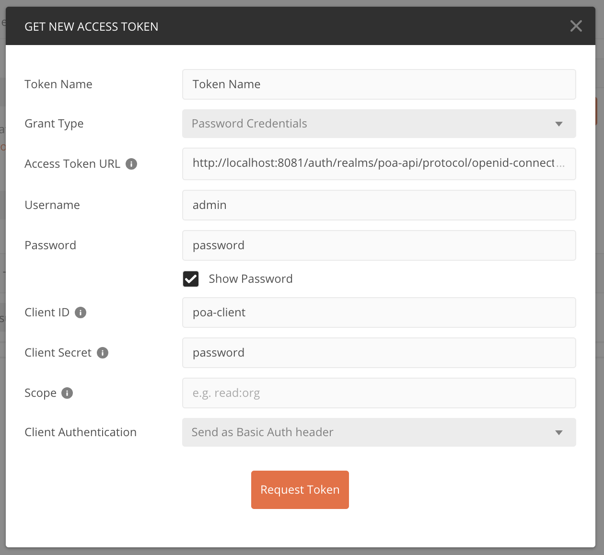

# Power of Attorney Service
  - Power of attorney details such as grantee, grantor and account details (/power-of-attorneys/{id})
  - Details for card products authorized by the power of attorney (/debit-cards/{id} and /credit-cards/{id})
  - Account details (/accounts/{id})
  
## Exercise!
  - ~~Build a REST API presenting aggregated information from different services~~
  - ~~Only show data that a user is actually authorized for~~
     - OAUTH2 is used for authentication/authorization
  - ~~Handle any server errors you might run into gracefully~~
  - ~~Don't return inactive products or accounts~~
     - Removing out BLOCKED CREDIT/DEBIT card
     - My understanding is POA's should not be shown for closed accounts at all
     
## Future Work

* (Optional) Expose the API over HTTPS
* Implementing authorization logic once understanding more about the domain (Mechanism is demonstrated in `PowerOfAttorneyService`)

---
### Project outline

- The project was built in a contract-first manner, the public API and models are defined in `resources/contract.yml` 
- The API interface and models are generated
- Authentication is via Oauth2 using Keycloak as auth server
- Swagger UI is accessible from `http://localhost:8080/swagger-ui.html`
- jacoco coverage reports can be found at `build/jacoco-reports`
- Integration tests use the Cucumber framework, feature files are in `src/test/resources`
- In mempory H2 database is used


### Startup guide

Create a `.env` file in the root of the project and populate it with the users and passwords or supply them in the VM as you want:
```
MYSQL_ROOT_PASSWORD=ch4ng3m3s00n
MYSQL_USER=keycloak_admin
MYSQL_PASSWORD=ch4ng31t

KEYCLOAK_DB=keycloak
KEYCLOAK_USER=admin
KEYCLOAK_PASSWORD=ch4ng31t
KEYCLOAK_SECRET=secret
```

* build the project with gradle `gradle build`
#### Without Authentication
* Start the application with `docker-compose up`
* check `http://localhost:8080/swagger-ui.html` for available endpoints
* import `src/main/resources/contract.yml` to PostMan
#### With Authentication
* Start the services with `docker-compose -f docker-compose-services.yml up -d` (THIS NEEDS TO BE DONE before starting the app!)
* start the application by either `java -jar build/libs/poa-api-0.0.1-SNAPSHOT.jar --spring.profiles.active=local`
* check `http://localhost:8080/swagger-ui.html` for available endpoints
* import `src/main/resources/contract.yml` to PostMan

### Oauth
* Realm: `poa-api`
* Client ID's: 
  * `poa-admin`
  * `poa-grantor`
  * `poa-grantee`
* password: `password` in all above cases(This has to be changed at first logon to Keycloak)
* access token url: `http://localhost:8081/auth/realms/poa-api/protocol/openid-connect/token`



